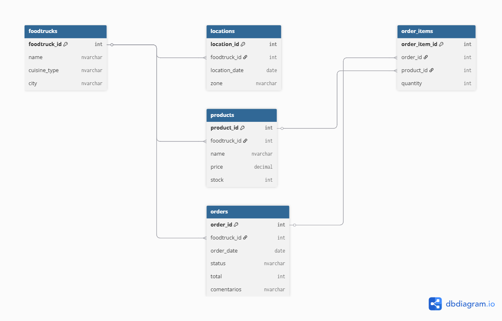

# foodtrack-db
Diseñar el esquema relacional inicial de FoodTrack, una plataforma para gestionar operaciones de foodtrucks en distintos puntos de una ciudad.

Implementá este esquema en Microsoft SQL Server, utilizando DBeaver como cliente, y gestioná todas las versiones del proyecto con Git y GitHub.

La base debe contemplar la información de foodtrucks, productos, pedidos, ubicaciones y detalle de ítems pedidos. El objetivo es simular un entorno de desarrollo profesional, donde se trabaja con un motor robusto como SQL Server y se aplica versionado desde el inicio del proyecto.

Bases para trabajar:

- foodtrucks
- locations
- order_items
- orders
- products

## Estructura de la base de datos

La base de datos `DBEAVER` está compuesta por cinco tablas que modelan las operaciones de una red de foodtrucks.

### `foodtrucks`

Tabla central del esquema. Registra cada foodtruck activo en la plataforma.

| Columna | Tipo | Descripción |
|---|---|---|
| `foodtruck_id` | INT (PK) | Identificador único del foodtruck |
| `name` | NVARCHAR(100) | Nombre comercial del foodtruck |
| `cuisine_type` | NVARCHAR(100) | Tipo de cocina que ofrece (ej: mexicana, italiana) |
| `city` | NVARCHAR(100) | Ciudad en la que opera |
